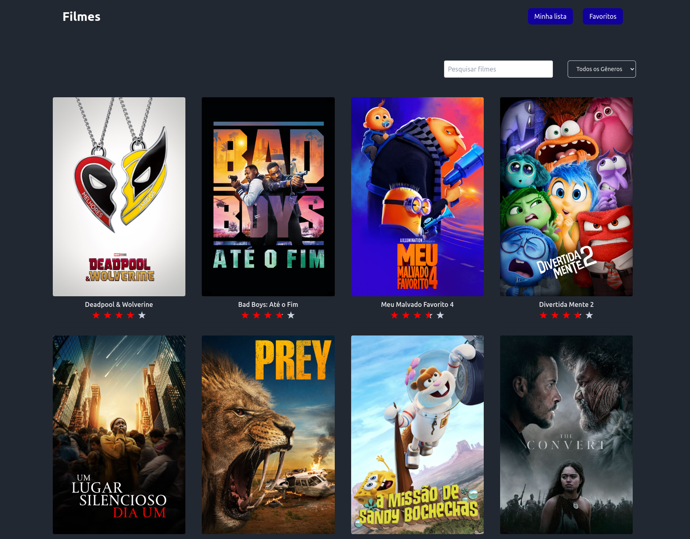

# 🎬 Movies App

 <!-- Pode adicionar uma imagem representativa do projeto aqui -->

## 🚀 Sobre o Projeto

**Movie Explorer** é uma aplicação web desenvolvida em React que permite aos usuários explorar filmes, filtrar por gênero, realizar buscas por título e gerenciar listas de favoritos e de filmes para assistir mais tarde. O projeto consome a API do [The Movie Database (TMDB)](https://www.themoviedb.org/) para fornecer dados em tempo real sobre os filmes.

## 🧠 Motivação

Este projeto foi desenvolvido com o objetivo de aprofundar meus conhecimentos em tecnologias como React, TypeScript e Tailwind CSS, além de praticar a integração com APIs RESTful. Busquei criar uma aplicação robusta e atrativa, aplicando as melhores práticas de desenvolvimento front-end, e focando em desempenho e experiência do usuário.

## 🔍 Funcionalidades

- **Pesquisa por Título:** Permite que os usuários encontrem filmes rapidamente através de um campo de busca.
- **Filtragem por Gênero:** Os usuários podem filtrar os filmes por diferentes gêneros, facilitando a descoberta de novos filmes.
- **Lista de Favoritos:** Os usuários podem adicionar filmes à sua lista de favoritos para fácil acesso posterior.
- **Compartilhar Favoritos:** Os usuários podem compartilhar suas listas de favoritos com outras pessoas em formato PDF.
- **Assistir Mais Tarde:** Permite salvar filmes para assistir mais tarde, gerenciando uma lista separada de favoritos.
- **Avaliação de Filmes:** Exibe avaliações de filmes com estrelas utilizando a biblioteca `react-star-ratings`.
- **Feedback ao Usuário:** Notificações instantâneas para ações como adicionar ou remover filmes das listas, utilizando `react-hot-toast`.

## 🛠️ Tecnologias Utilizadas

- **React**: Biblioteca JavaScript para construção de interfaces de usuário.
- **TypeScript**: Superset do JavaScript que adiciona tipagem estática ao código.
- **Tailwind CSS**: Framework CSS utilitário para estilização rápida e responsiva.
- **Axios**: Cliente HTTP baseado em Promises para realizar requisições à API do TMDB.
- **React Hot Toast**: Biblioteca para exibir notificações de maneira elegante e fácil.
- **React Star Ratings**: Componente React para exibição de avaliações com estrelas.
- **Vite**: Ferramenta de construção e desenvolvimento ultrarrápida.

## 📦 Instalação

Para rodar o projeto localmente, siga os passos abaixo:

1. **Clone o repositório:**
   ```bash
   git clone https://github.com/crishard/movies-app.git
   ```

2. **Navegue até o diretório do projeto:**
   ```bash
   cd movies-app
   ```

3. **Instale as dependências:**
   ```bash
   npm install
   ```

4. **Adicione suas credenciais da API do TMDB:**
   Crie um arquivo `.env` na raiz do projeto e adicione sua chave de API e o seu token:
   ```plaintext
   VITE_TMDB_API_KEY=your_api_key_here
   VITE_TOKEN=your_token_api
   ```

5. **Execute o projeto:**
   ```bash
   npm run dev
   ```

6. **Acesse o projeto:**
   Abra o navegador e vá para `http://localhost:5173/`.

## 💡 Decisões de Projeto

- **Organização Modular:** Componentes foram divididos em módulos menores para promover a reutilização de código e facilitar a manutenção.
- **Hooks Customizados:** Foram utilizados hooks personalizados para encapsular a lógica de interação com a API e o gerenciamento de estados complexos.
- **Responsividade:** Tailwind CSS foi utilizado para garantir que a interface seja totalmente responsiva, oferecendo uma experiência consistente em diferentes dispositivos.

## 📝 Conclusão

**Movie App** é mais do que um simples explorador de filmes; é um projeto que reflete um esforço dedicado para aprender, implementar e melhorar minhas habilidades em desenvolvimento front-end. A criação deste projeto envolveu desafios significativos, como a integração com uma API externa e a manipulação eficiente do estado, mas resultou em um produto final que é funcional, atrativo e escalável.

Se você é um recrutador, gostaria de enfatizar que este projeto demonstra minha capacidade de aprender e aplicar novas tecnologias, bem como minha paixão por criar experiências de usuário elegantes e intuitivas.
